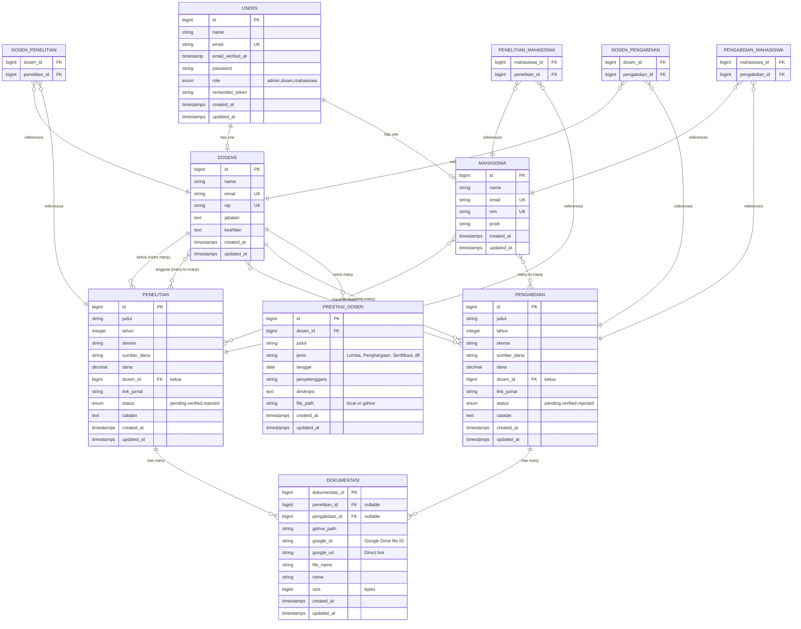

# Database Schema - SIDOPPAN

## Entity Relationship Diagram (ERD)



---

## Database Indexes

```sql
-- Primary Keys
ALTER TABLE users ADD PRIMARY KEY (id);
ALTER TABLE dosens ADD PRIMARY KEY (id);
ALTER TABLE mahasiswa ADD PRIMARY KEY (id);
ALTER TABLE penelitian ADD PRIMARY KEY (id);
ALTER TABLE pengabdian ADD PRIMARY KEY (id);
ALTER TABLE dokumentasi ADD PRIMARY KEY (dokumentasi_id);
ALTER TABLE prestasi_dosen ADD PRIMARY KEY (id);

-- Unique Keys
ALTER TABLE users ADD UNIQUE KEY users_email_unique (email);
ALTER TABLE dosens ADD UNIQUE KEY dosens_email_unique (email);
ALTER TABLE dosens ADD UNIQUE KEY dosens_nip_unique (nip);
ALTER TABLE mahasiswa ADD UNIQUE KEY mahasiswa_email_unique (email);
ALTER TABLE mahasiswa ADD UNIQUE KEY mahasiswa_nim_unique (nim);

-- Foreign Keys
ALTER TABLE dosens ADD CONSTRAINT fk_dosens_users 
    FOREIGN KEY (email) REFERENCES users(email) ON DELETE CASCADE;

ALTER TABLE mahasiswa ADD CONSTRAINT fk_mahasiswa_users 
    FOREIGN KEY (email) REFERENCES users(email) ON DELETE CASCADE;

ALTER TABLE penelitian ADD CONSTRAINT fk_penelitian_dosen 
    FOREIGN KEY (dosen_id) REFERENCES dosens(id) ON DELETE CASCADE;

ALTER TABLE pengabdian ADD CONSTRAINT fk_pengabdian_dosen 
    FOREIGN KEY (dosen_id) REFERENCES dosens(id) ON DELETE CASCADE;

ALTER TABLE dokumentasi ADD CONSTRAINT fk_dokumentasi_penelitian 
    FOREIGN KEY (penelitian_id) REFERENCES penelitian(id) ON DELETE CASCADE;

ALTER TABLE dokumentasi ADD CONSTRAINT fk_dokumentasi_pengabdian 
    FOREIGN KEY (pengabdian_id) REFERENCES pengabdian(id) ON DELETE CASCADE;

ALTER TABLE prestasi_dosen ADD CONSTRAINT fk_prestasi_dosen 
    FOREIGN KEY (dosen_id) REFERENCES dosens(id) ON DELETE CASCADE;

-- Pivot Table Foreign Keys
ALTER TABLE dosen_penelitian ADD CONSTRAINT fk_dp_dosen 
    FOREIGN KEY (dosen_id) REFERENCES dosens(id) ON DELETE CASCADE;
ALTER TABLE dosen_penelitian ADD CONSTRAINT fk_dp_penelitian 
    FOREIGN KEY (penelitian_id) REFERENCES penelitian(id) ON DELETE CASCADE;

ALTER TABLE dosen_pengabdian ADD CONSTRAINT fk_dpen_dosen 
    FOREIGN KEY (dosen_id) REFERENCES dosens(id) ON DELETE CASCADE;
ALTER TABLE dosen_pengabdian ADD CONSTRAINT fk_dpen_pengabdian 
    FOREIGN KEY (pengabdian_id) REFERENCES pengabdian(id) ON DELETE CASCADE;

ALTER TABLE penelitian_mahasiswa ADD CONSTRAINT fk_pm_penelitian 
    FOREIGN KEY (penelitian_id) REFERENCES penelitian(id) ON DELETE CASCADE;
ALTER TABLE penelitian_mahasiswa ADD CONSTRAINT fk_pm_mahasiswa 
    FOREIGN KEY (mahasiswa_id) REFERENCES mahasiswa(id) ON DELETE CASCADE;

ALTER TABLE pengabdian_mahasiswa ADD CONSTRAINT fk_penm_pengabdian 
    FOREIGN KEY (pengabdian_id) REFERENCES pengabdian(id) ON DELETE CASCADE;
ALTER TABLE pengabdian_mahasiswa ADD CONSTRAINT fk_penm_mahasiswa 
    FOREIGN KEY (mahasiswa_id) REFERENCES mahasiswa(id) ON DELETE CASCADE;

-- Indexes for performance
CREATE INDEX idx_penelitian_tahun ON penelitian(tahun);
CREATE INDEX idx_penelitian_status ON penelitian(status);
CREATE INDEX idx_pengabdian_tahun ON pengabdian(tahun);
CREATE INDEX idx_pengabdian_status ON pengabdian(status);
CREATE INDEX idx_dokumentasi_google_id ON dokumentasi(google_id);
```

---

## Data Flow Summary

### 1. User Registration & Authentication
```
Users (email, password, role) 
  → IF role = 'dosen' → Create Dosens record
  → IF role = 'mahasiswa' → Create Mahasiswa record
  → IF role = 'admin' → No additional record
```

### 2. Penelitian Creation (Dosen)
```
Dosen creates Penelitian
  → penelitian.dosen_id = ketua_id
  → dosen_penelitian (pivot) → anggota dosen
  → penelitian_mahasiswa (pivot) → mahasiswa involved
  → Upload file → Dokumentasi (with google_id)
```

### 3. Dokumentasi Upload
```
Dosen/Mahasiswa uploads file
  → GoogleDriveService.upload()
  → Dokumentasi record created
    - gdrive_path: 'Penelitian/123/file.pdf'
    - google_id: 'abc123xyz'
    - google_url: 'https://drive.google.com/file/d/...'
```

### 4. Admin Verification
```
Admin views Penelitian/Pengabdian
  → Update status: pending → verified/rejected
  → Add catatan (notes)
  → (Optional) Send email notification
```

---

## Google Drive Storage Structure

```
Google Drive Root
└── Integrasi Sistem PBL Drive/
    ├── Penelitian/
    │   ├── {penelitian_id_1}/
    │   │   ├── laporan_proposal.pdf
    │   │   ├── laporan_akhir.pdf
    │   │   └── jurnal.pdf
    │   └── {penelitian_id_2}/
    │       └── ...
    ├── Pengabdian/
    │   ├── {pengabdian_id_1}/
    │   │   └── laporan.pdf
    │   └── {pengabdian_id_2}/
    │       └── ...
    └── Mahasiswa/
        ├── Penelitian/
        │   └── {penelitian_id}/
        │       ├── dokumentasi_1.jpg
        │       └── dokumentasi_2.pdf
        └── Pengabdian/
            └── {pengabdian_id}/
                └── dokumentasi.jpg
```

---

## Sample Data

### Users & Roles
```sql
-- Admin
INSERT INTO users (name, email, password, role) 
VALUES ('Admin System', 'admin@pbl.ac.id', '$hashed', 'admin');

-- Dosen
INSERT INTO users (name, email, password, role) 
VALUES ('Dr. John Doe', 'john@pbl.ac.id', '$hashed', 'dosen');
INSERT INTO dosens (nama, email, nip, jabatan) 
VALUES ('Dr. John Doe', 'john@pbl.ac.id', '1234567890', 'Lektor Kepala');

-- Mahasiswa
INSERT INTO users (name, email, password, role) 
VALUES ('Jane Student', 'jane@student.pbl.ac.id', '$hashed', 'mahasiswa');
INSERT INTO mahasiswa (nama, email, nim, prodi) 
VALUES ('Jane Student', 'jane@student.pbl.ac.id', '2021001', 'Teknik Informatika');
```

### Penelitian with Relations
```sql
-- Create penelitian
INSERT INTO penelitian (judul, tahun, skema, dana, dosen_id, status) 
VALUES ('AI for Healthcare', 2025, 'Penelitian Dosen Pemula', 50000000, 1, 'pending');

-- Add anggota dosen
INSERT INTO dosen_penelitian (dosen_id, penelitian_id) VALUES (2, 1);
INSERT INTO dosen_penelitian (dosen_id, penelitian_id) VALUES (3, 1);

-- Add mahasiswa
INSERT INTO penelitian_mahasiswa (mahasiswa_id, penelitian_id) VALUES (1, 1);
INSERT INTO penelitian_mahasiswa (mahasiswa_id, penelitian_id) VALUES (2, 1);

-- Add dokumentasi
INSERT INTO dokumentasi (penelitian_id, gdrive_path, google_id, google_url, file_name, mime, size) 
VALUES (1, 'Penelitian/1/proposal.pdf', 'abc123', 'https://drive.google.com/...', 'Proposal.pdf', 'application/pdf', 2048000);
```
