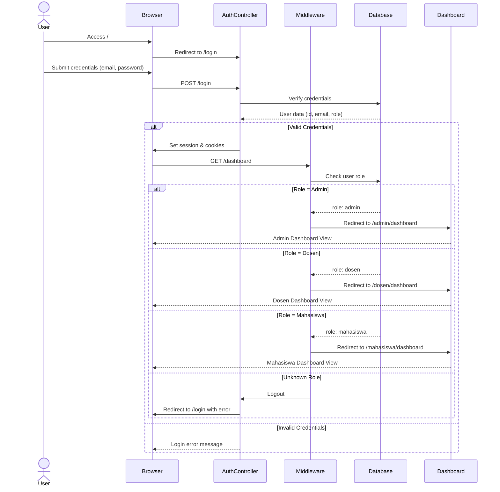
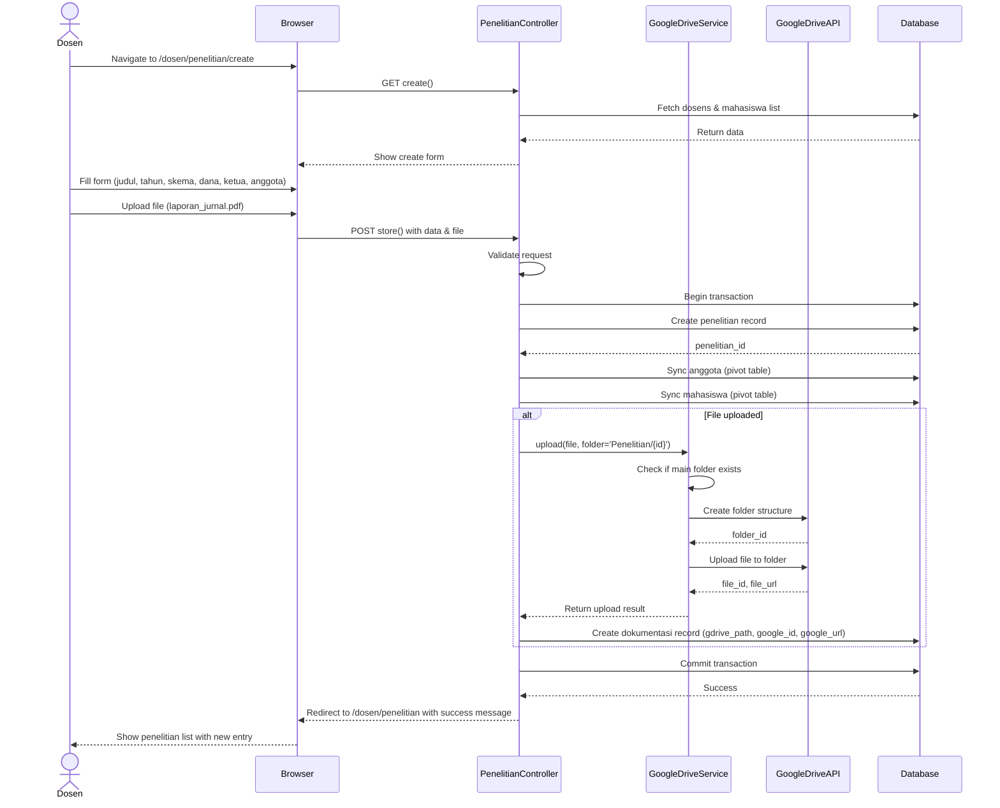
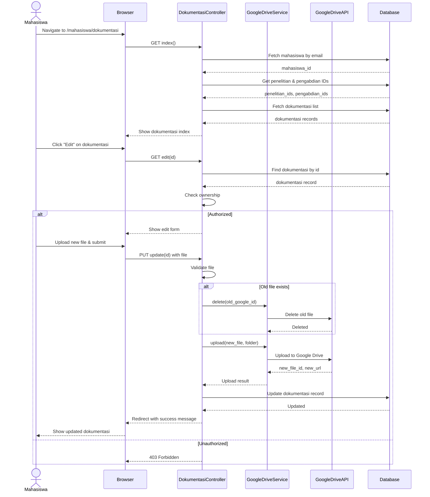
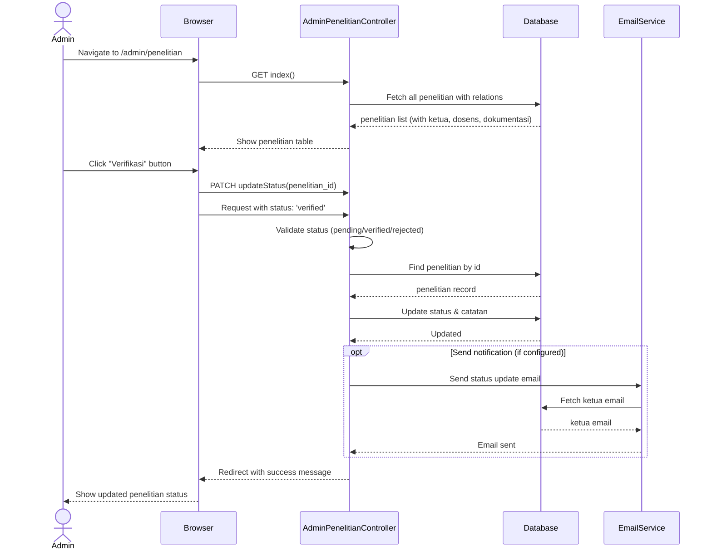
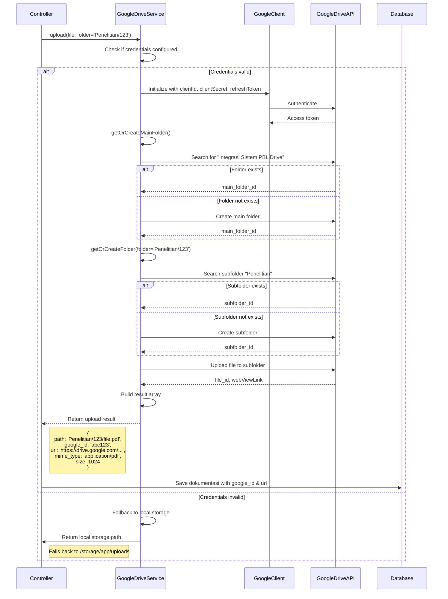
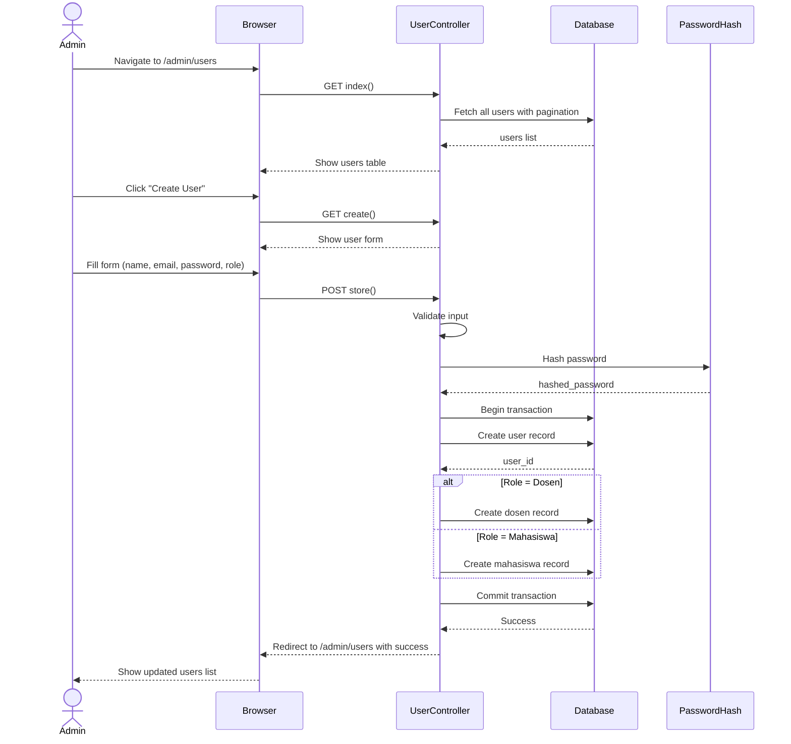
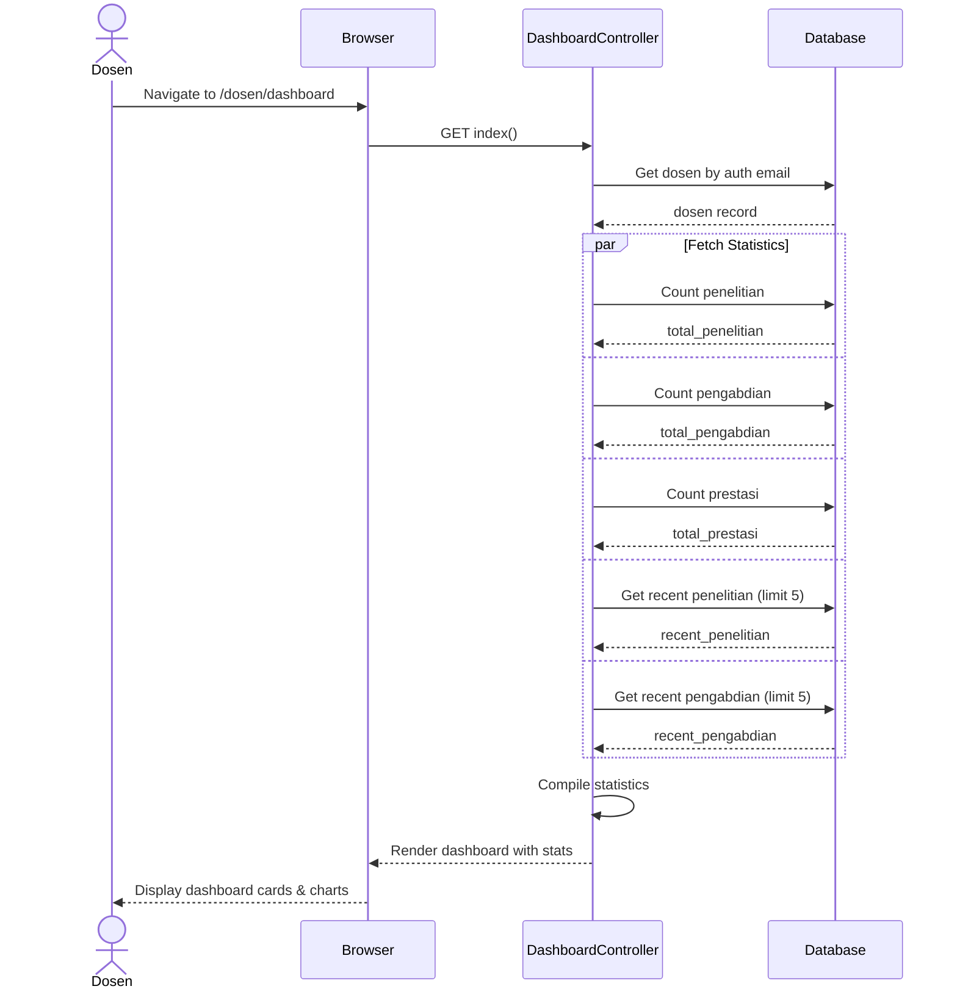
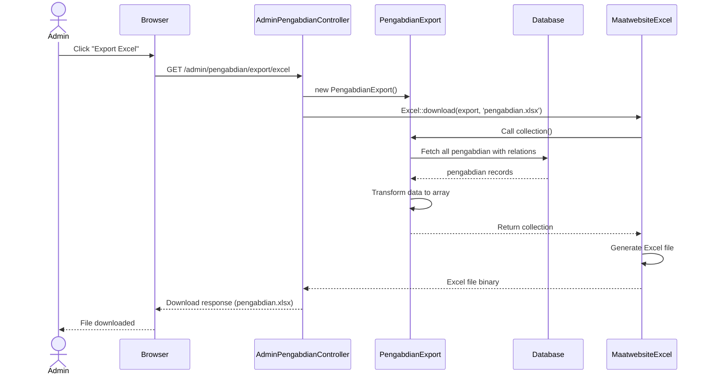

# Sequence Diagrams - SIDOPPAN (Sistem Dokumentasi Penelitian, Pengabdian, Prestasi)

## 1. Authentication & Role-Based Redirect Flow

---

## 2. Dosen - Create Penelitian with Google Drive Upload

---

## 3. Mahasiswa - Upload Dokumentasi

---

## 4. Admin - Verify Penelitian Status

---

## 5. Google Drive Integration - Upload Flow

---

## 6. Admin - User Management (CRUD)

---

## 7. Dosen Dashboard - Statistics Overview

---

## 8. Export Pengabdian to Excel

---

## Keterangan Flow Utama

### Role-Based Access:
- **Admin**: Kelola users, verify penelitian/pengabdian, view all data, export Excel
- **Dosen**: CRUD penelitian/pengabdian/prestasi, upload dokumentasi
- **Mahasiswa**: View & upload dokumentasi terkait penelitian/pengabdian mereka

### Google Drive Integration:
- Otomatis membuat folder "Integrasi Sistem PBL Drive"
- Struktur: `Main Folder / [Penelitian|Pengabdian|Mahasiswa] / {ID} / files`
- Fallback ke local storage jika credentials tidak ada
- Menyimpan `google_id` dan `google_url` di database

### Database Relations:
- **User** → (has one) → **Dosen** atau **Mahasiswa**
- **Penelitian** → (belongs to) → **Dosen** (ketua)
- **Penelitian** → (many-to-many) → **Dosen** (anggota)
- **Penelitian** → (many-to-many) → **Mahasiswa**
- **Penelitian** → (has many) → **Dokumentasi**
- **Pengabdian** → (similar structure)
- **Dokumentasi** → (polymorphic / belongs to) → **Penelitian** atau **Pengabdian**

---

## Tools Used:
- **Mermaid.js** for sequence diagrams
- **Laravel 10+** framework
- **Google Drive API** for file storage
- **Maatwebsite/Laravel-Excel** for export
- **MySQL/MariaDB** database
