# Use Case Diagram - SIDOPPAN

## Complete System Use Case Diagram

```mermaid
graph TB
    subgraph "SIDOPPAN System"
        subgraph "Authentication"
            UC1[Login]
            UC2[Logout]
            UC3[Register via Google SSO]
            UC4[Reset Password]
        end
        
        subgraph "Admin Use Cases"
            UC5[Kelola User]
            UC6[Create User]
            UC7[Edit User]
            UC8[Delete User]
            UC9[View All Penelitian]
            UC10[Verify Penelitian]
            UC11[Reject Penelitian]
            UC12[View All Pengabdian]
            UC13[Verify Pengabdian]
            UC14[Reject Pengabdian]
            UC15[Export Pengabdian to Excel]
            UC16[View All Prestasi]
            UC17[View Dashboard Statistics]
        end
        
        subgraph "Dosen Use Cases"
            UC18[View Dosen Dashboard]
            UC19[Create Penelitian]
            UC20[Edit Penelitian]
            UC21[Delete Penelitian]
            UC22[View Penelitian Detail]
            UC23[Upload Dokumentasi Penelitian]
            UC24[Create Pengabdian]
            UC25[Edit Pengabdian]
            UC26[Delete Pengabdian]
            UC27[Upload Dokumentasi Pengabdian]
            UC28[Create Prestasi]
            UC29[Edit Prestasi]
            UC30[View Prestasi List]
        end
        
        subgraph "Mahasiswa Use Cases"
            UC31[View Mahasiswa Dashboard]
            UC32[View Dokumentasi List]
            UC33[Upload Dokumentasi]
            UC34[Edit Dokumentasi]
            UC35[Delete Dokumentasi]
            UC36[View Penelitian Involvement]
            UC37[View Pengabdian Involvement]
        end
        
        subgraph "Profile Management"
            UC38[View Profile]
            UC39[Edit Profile]
            UC40[Change Password]
        end
        
        subgraph "Google Drive Integration"
            UC41[Auto Upload to Google Drive]
            UC42[Auto Folder Creation]
            UC43[Get File Link]
            UC44[Delete File from Drive]
        end
    end
    
    Admin((Admin))
    Dosen((Dosen))
    Mahasiswa((Mahasiswa))
    GoogleDrive[Google Drive API]
    EmailService[Email Service]
    
    %% Admin connections
    Admin --> UC1
    Admin --> UC2
    Admin --> UC5
    Admin --> UC17
    UC5 --> UC6
    UC5 --> UC7
    UC5 --> UC8
    Admin --> UC9
    UC9 --> UC10
    UC9 --> UC11
    Admin --> UC12
    UC12 --> UC13
    UC12 --> UC14
    Admin --> UC15
    Admin --> UC16
    Admin --> UC38
    Admin --> UC39
    Admin --> UC40
    
    %% Dosen connections
    Dosen --> UC1
    Dosen --> UC2
    Dosen --> UC18
    Dosen --> UC19
    Dosen --> UC20
    Dosen --> UC21
    Dosen --> UC22
    UC19 --> UC23
    UC20 --> UC23
    Dosen --> UC24
    Dosen --> UC25
    Dosen --> UC26
    UC24 --> UC27
    UC25 --> UC27
    Dosen --> UC28
    Dosen --> UC29
    Dosen --> UC30
    Dosen --> UC38
    Dosen --> UC39
    Dosen --> UC40
    
    %% Mahasiswa connections
    Mahasiswa --> UC1
    Mahasiswa --> UC2
    Mahasiswa --> UC31
    Mahasiswa --> UC32
    Mahasiswa --> UC33
    Mahasiswa --> UC34
    Mahasiswa --> UC35
    Mahasiswa --> UC36
    Mahasiswa --> UC37
    Mahasiswa --> UC38
    Mahasiswa --> UC39
    Mahasiswa --> UC40
    
    %% Google SSO
    UC3 --> GoogleDrive
    
    %% Google Drive Integration
    UC23 --> UC41
    UC27 --> UC41
    UC33 --> UC41
    UC34 --> UC41
    UC41 --> UC42
    UC41 --> UC43
    UC34 --> UC44
    UC41 --> GoogleDrive
    UC42 --> GoogleDrive
    UC43 --> GoogleDrive
    UC44 --> GoogleDrive
    
    %% Email notifications
    UC10 -.->|notify| EmailService
    UC11 -.->|notify| EmailService
    UC13 -.->|notify| EmailService
    UC14 -.->|notify| EmailService
    
    style Admin fill:#e74c3c,stroke:#c0392b,stroke-width:2px,color:#fff
    style Dosen fill:#3498db,stroke:#2980b9,stroke-width:2px,color:#fff
    style Mahasiswa fill:#2ecc71,stroke:#27ae60,stroke-width:2px,color:#fff
```

---

## Detailed Use Case Specifications

### 1. UC19 - Create Penelitian (Dosen)

**Actor**: Dosen  
**Precondition**: Dosen is logged in  
**Main Flow**:
1. Dosen navigates to `/dosen/penelitian/create`
2. System displays penelitian form with:
   - Judul penelitian
   - Tahun pelaksanaan
   - Skema penelitian (dropdown)
   - Sumber dana (dropdown)
   - Jumlah dana
   - Ketua penelitian (selected from dosens)
   - Anggota dosen (multi-select)
   - Mahasiswa terlibat (multi-select)
   - Link jurnal (optional)
   - Upload laporan/jurnal (PDF, max 5MB)
3. Dosen fills form and uploads file
4. System validates input
5. System creates penelitian record in database
6. System uploads file to Google Drive (`Penelitian/{id}/`)
7. System creates dokumentasi record with google_id
8. System shows success message
9. System redirects to penelitian list

**Postcondition**: New penelitian created with status "pending"  
**Alternative Flow**:
- 4a. Validation fails → Show error messages
- 6a. Google Drive upload fails → Fallback to local storage

---

### 2. UC10 - Verify Penelitian (Admin)

**Actor**: Admin  
**Precondition**: Admin is logged in, penelitian exists with status "pending"  
**Main Flow**:
1. Admin navigates to `/admin/penelitian`
2. System displays all penelitian with status badges
3. Admin clicks "Verifikasi" button on penelitian
4. System shows confirmation modal with:
   - Status dropdown (Pending/Verified/Rejected)
   - Catatan textarea
5. Admin selects "Verified" and adds notes (optional)
6. Admin confirms action
7. System updates penelitian.status = 'verified'
8. System saves catatan
9. System sends email notification to ketua (optional)
10. System redirects back with success message

**Postcondition**: Penelitian status changed to "verified"  
**Alternative Flow**:
- 5a. Admin selects "Rejected" → Status becomes "rejected"
- 9a. Email service unavailable → Skip notification

---

### 3. UC33 - Upload Dokumentasi (Mahasiswa)

**Actor**: Mahasiswa  
**Precondition**: Mahasiswa is logged in, involved in penelitian/pengabdian  
**Main Flow**:
1. Mahasiswa navigates to `/mahasiswa/dokumentasi`
2. System shows penelitian/pengabdian cards where mahasiswa is involved
3. Mahasiswa clicks "Upload Dokumentasi" on a card
4. System opens file upload modal
5. Mahasiswa selects file (JPG/PNG/PDF, max 4MB)
6. Mahasiswa enters file_name (optional)
7. Mahasiswa clicks "Upload"
8. System validates file
9. System determines context (penelitian or pengabdian)
10. System uploads file to Google Drive (`Mahasiswa/{context}/{id}/`)
11. System creates dokumentasi record with:
    - penelitian_id or pengabdian_id
    - gdrive_path
    - google_id
    - google_url
12. System shows success message
13. System refreshes dokumentasi list

**Postcondition**: New dokumentasi uploaded and linked  
**Alternative Flow**:
- 8a. File validation fails → Show error
- 10a. Google Drive upload fails → Fallback to local storage

---

### 4. UC15 - Export Pengabdian to Excel (Admin)

**Actor**: Admin  
**Precondition**: Admin is logged in  
**Main Flow**:
1. Admin navigates to `/admin/pengabdian`
2. Admin clicks "Export Excel" button
3. System fetches all pengabdian data with relations:
   - Ketua (dosen)
   - Anggota (dosens)
   - Mahasiswa
   - Dokumentasi
4. System transforms data to Excel format
5. System generates .xlsx file using Maatwebsite/Excel
6. System triggers browser download
7. File `pengabdian_YYYY-MM-DD.xlsx` downloaded

**Postcondition**: Excel file downloaded to admin's computer  
**Alternative Flow**:
- 3a. No pengabdian data → Export empty template

---

### 5. UC41 - Auto Upload to Google Drive

**Actor**: System (triggered by Dosen/Mahasiswa upload action)  
**Precondition**: File uploaded via form, Google Drive credentials configured  
**Main Flow**:
1. System receives file from request
2. System checks Google Drive credentials
3. System initializes Google Client with:
   - clientId
   - clientSecret
   - refreshToken
4. System authenticates with Google API
5. System calls `getOrCreateMainFolder()`
   - Search for "Integrasi Sistem PBL Drive"
   - Create if not exists
6. System calls `getOrCreateFolder(subfolder)`
   - Parse folder structure (e.g., "Penelitian/123")
   - Create nested folders if needed
7. System uploads file to target folder
8. System receives response:
   - google_id (file ID)
   - webViewLink (shareable URL)
9. System returns upload result to controller

**Postcondition**: File stored in Google Drive with unique ID  
**Alternative Flow**:
- 2a. Credentials not configured → Use local storage
- 4a. Authentication fails → Log error, fallback to local
- 7a. Upload fails (quota/network) → Retry or fallback

---

## Use Case Relationships

### Include Relationships:
- **UC19 (Create Penelitian)** includes **UC41 (Auto Upload)**
- **UC24 (Create Pengabdian)** includes **UC41 (Auto Upload)**
- **UC33 (Upload Dokumentasi)** includes **UC41 (Auto Upload)**
- **UC41 (Auto Upload)** includes **UC42 (Auto Folder Creation)**

### Extend Relationships:
- **UC10 (Verify Penelitian)** extends with **Email Notification**
- **UC11 (Reject Penelitian)** extends with **Email Notification**
- **UC34 (Edit Dokumentasi)** extends **UC44 (Delete Old File from Drive)**

### Generalization:
- **UC38, UC39, UC40 (Profile Management)** → Used by all roles (Admin, Dosen, Mahasiswa)
- **UC1, UC2 (Authentication)** → Used by all roles

---

## Actor Descriptions

### Admin
**Responsibilities**:
- Manage all users (CRUD operations)
- Verify or reject penelitian/pengabdian
- View system-wide statistics
- Export data to Excel
- Full access to all modules

**Goals**:
- Ensure data quality through verification
- Manage user accounts efficiently
- Generate reports for decision-making

---

### Dosen
**Responsibilities**:
- Create and manage penelitian/pengabdian
- Upload documentation (proposals, reports, journals)
- Record prestasi (achievements, awards, certifications)
- Collaborate with other dosens and mahasiswa
- Track research/community service progress

**Goals**:
- Document all research and community service activities
- Maintain records for academic reporting
- Collaborate effectively with teams

---

### Mahasiswa
**Responsibilities**:
- Upload dokumentasi for assigned penelitian/pengabdian
- View involvement in research/community service
- Manage personal documentation
- Update profile information

**Goals**:
- Contribute documentation for projects
- Track involvement in academic activities
- Build portfolio of participation

---

## System Actors

### Google Drive API
**Purpose**: Cloud storage for files  
**Interactions**:
- Receive file upload requests
- Create folder structures
- Return file IDs and shareable links
- Handle file deletions

### Email Service (Optional)
**Purpose**: Notification system  
**Interactions**:
- Send verification status updates
- Notify users of important changes
- Send password reset emails
